<table>
    <tr>
        <td width="50%" valign="top">
            <h2>
                <strong>Alexsandro Ocanha Rodrigues</strong>
            </h2>
            
Hi! My name is `Alexsandro`. I'm just a technology enthusiast. I love working with `network infrastructure`, servers,  `cloud infrastructure` and `cyber security`. I am currently pursuing the `CCNP DC` certification. If you'd like to chat or exchange ideas, contact me via email.
            

            <h2><strong>Experience</strong></h2>
            <h4><strong>DevSecOps Intern @ Compass UOL</strong></h4>
            
Supported the development and maintenance of CI/CD pipelines, infrastructure automation using Infrastructure as Code (IaC), and the application of cloud security best practices, focusing on reliability and standardized deployment processes.
            

             
        </td>
        <td width="50%" valign="top">
            <h2><strong>Status</strong></h2>
            
            
        </td>
    </tr>
</table>

    

      
      
      
    

