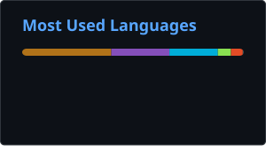

<table>
    <tr>
        <td width="55%" valign="top">

<h2><strong>Alexsandro Ocanha Rodrigues</strong></h2>

    
Hi! I'm Alexsandro, an infrastructure enthusiast who becomes more passionate about technology every day. I enjoy solving complex problems, building reliable environments, and continuously learning new technologies. My goal is to work as a DevOps Engineer or Infrastructure Engineer specializing in Cloud or Data Center environments. I'm currently in the final stage of my Bachelor's degree (6th semester) and looking for new opportunities. Outside of work, you'll probably find me spending hours troubleshooting systems with a good cup of coffee by my side.

## Roadmap from 2026

- [x] AWS Certified Solutions Architect – Associate
- [ ] Microsoft Certified: Azure Administrator Associate (AZ-104)
- [ ] Certified Kubernetes Administrator (CKA)

 
</td>

<td width="45%" valign="top">

<h2 align="center"><strong>GitHub Stats</strong></h2>

    

 
 

</td>
    </tr>
</table>

 

