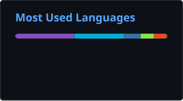

<table>
    <tr>
        <td width="55%" valign="top">

<h2><strong>Alexsandro Ocanha Rodrigues</strong></h2>

    
Hi! I'm Alexsandro, a technology enthusiast passionate about software development and problem-solving. I enjoy building applications, exploring new technologies, and turning ideas into practical solutions. I'm currently focusing on Python and JavaScript, while expanding my knowledge of software engineering, APIs, databases, and cloud technologies. My goal is to grow as a Software Developer, combining my background in IT infrastructure and cloud computing with my passion for programming. I'm always looking for opportunities to learn, build meaningful projects, and improve my skills. Outside of coding, you'll probably find me exploring new technologies with a good cup of coffee by my side.

## Roadmap from 2026

- [x] AWS Certified Solutions Architect – Associate
- [ ] Microsoft Certified: Azure Administrator Associate (AZ-104)
- [ ] Certified Kubernetes Administrator (CKA)
- [ ] Cisco Certified Network Associate (CCNA)

 
</td>

<td width="45%" valign="top">

<h2 align="center"><strong>GitHub Stats</strong></h2>

    

<h2 align="center"><strong>Stack</strong></h2>

  

 

</td>
    </tr>
</table>

 

